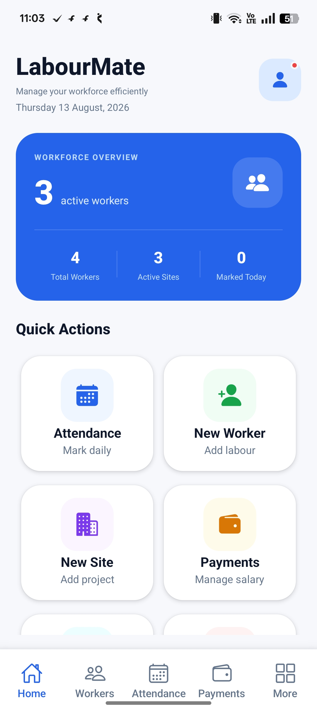
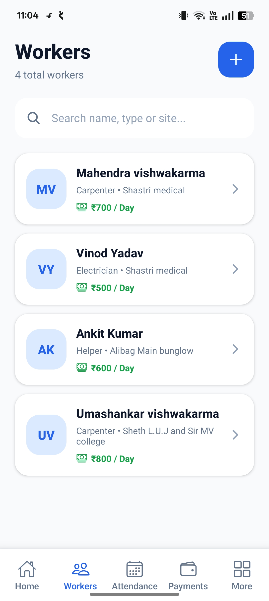
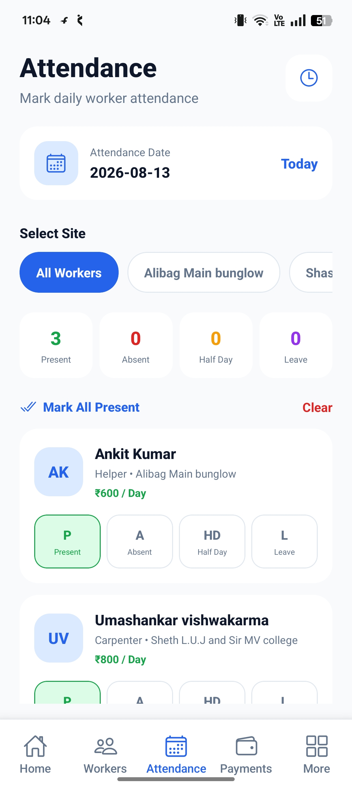
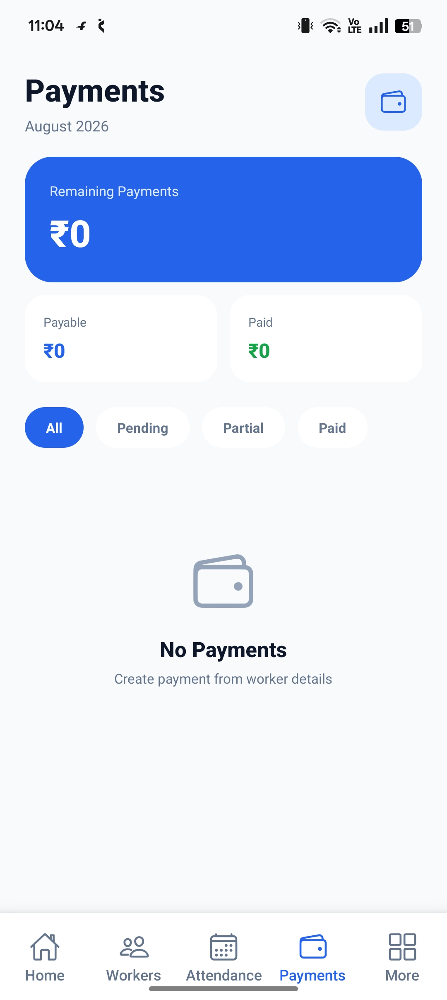

# LabourMate

## Workforce Management Mobile Application

LabourMate is a business-focused mobile application designed
to help contractors and businesses manage workers, sites,
attendance, payments and workforce operations from a single
mobile platform.

## Features

- 👷 Worker Management
- 🏗️ Site Management
- 📅 Attendance Tracking
- 💰 Payment Management
- 📊 Dashboard & Reports
- 🧾 Quotation & Billing
- 🔍 Search & Filtering
- 📱 Professional Mobile UI

## Tech Stack

- React Native
- Expo
- TypeScript
- Expo Router
- SQLite
- AsyncStorage

## Screenshots

### Dashboard

### Workers

### Attendance

### Payments

## Key Highlights
- Business-focused mobile workflow
- Reusable UI components
- Local database support
- Structured navigation
- Attendance and payment workflows
- Responsive mobile interface

## Project Status
Active development

## Developer
Umashankar Vishwakarma
React Native & Android Developer
